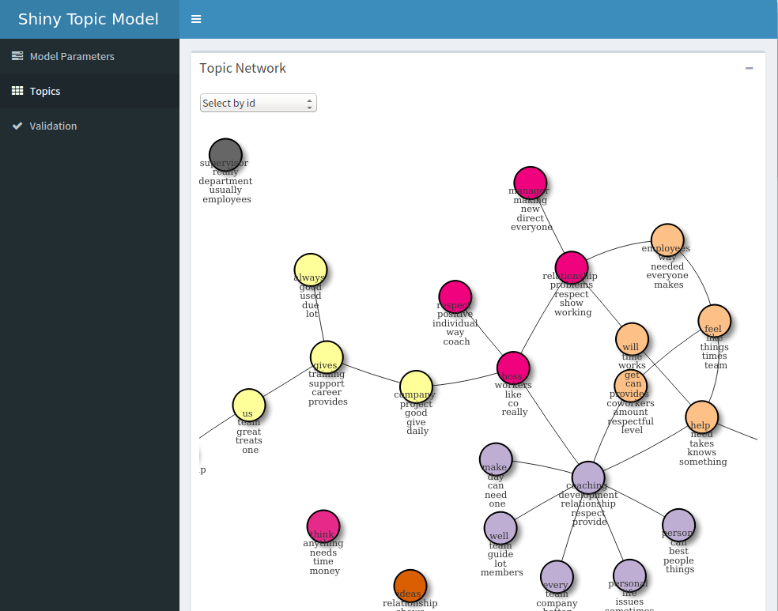
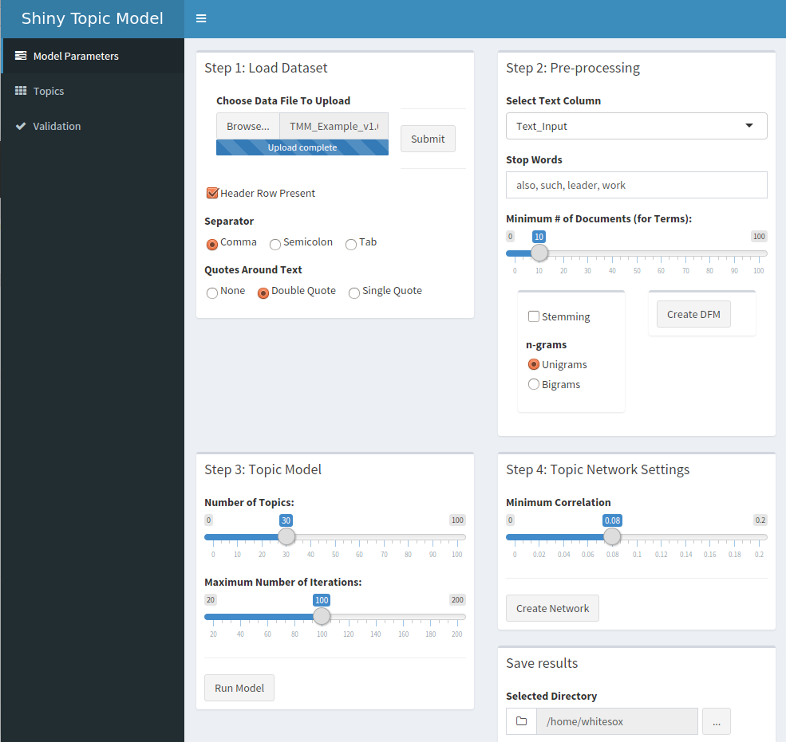
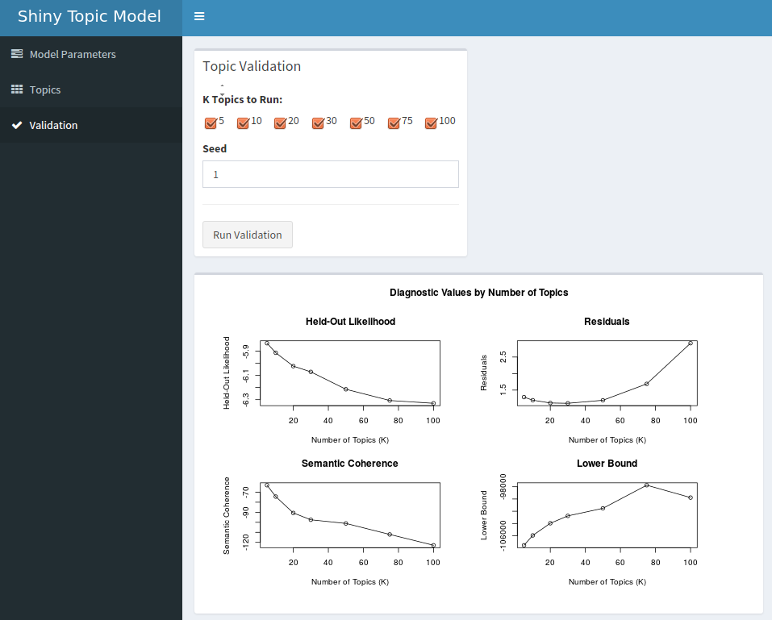

# topicApp: A Simple Shiny App for Topic Modeling

This GitHub repo provides an interactive app for running small (< 5 MB) text datasets. For larger datasets, we recommend our [GitHub repo](https://github.com/wesslen/text-analysis-org-science) that provides code examples of how to run manually topic modeling.

All materials are also archived on this [Dataverse]() page.

## Prerequisites for Windows users

Typically, R packages will automatically install dependent CRAN packages via the `install_github` function from `devtools`. However, for Windows (R >= 3.3.0), this function does not work.

Therefore, if you're running Windows, please run the following code to ensure you have the dependent packages before running the next step.

This may take a few minutes but you only need to run once.

```{r}
packages <- c("shiny","quanteda","shinydashboard","RColorBrewer","DT","visNetwork","ggwordcloud",
              "igraph","tm","reshape","grid","tidyverse","shinyjs","shinyBS","stm")

install.packages(packages)
```

## Download and Running

To install and the run the app, open R/R Studio and run the following code:

```{r}
install.packages("devtools")
devtools::install_github("wesslen/topicApp")
topicApp::runApp()
```







## FAQ/Help

1.  I'm getting an error message when trying to install the `slam` package (a dependency for several other packages).

Try to run this command in your R (or R Studio) Console:

```{r}
slam_url <- "https://cran.r-project.org/src/contrib/Archive/slam/slam_0.1-37.tar.gz" 
devtools::install_url(slam_url)
```

This should manually install the `slam` package.

2.  I want to use more features of the `stm` packages (e.g., include covariates).

This app has been created for only simple analyses (e.g., small datasets, no covariates, limited functionality). If you're interested in more functionality of the `stm` package, you should considering either running the code individually or use Dan Zangri's `stmgui` package (see [stmGUI GitHub](https://github.com/dzangri/stmGUI))

3.  I received an error that the file uploaded exceeded the maximum size (5MB+).

Yes. You will either (1) need to reduce the size of your dataset (e.g., remove unnecessary columns, sample records) or (2) consider running code manually. topicApp is only intended for small datasets and a starter solution for researchers new to R and topic modeling. For more advanced researchers, we recommend the code we've provided in our code repo [https://github.com/wesslen/text-analysis-org-science](https://github.com/wesslen/text-analysis-org-science).
